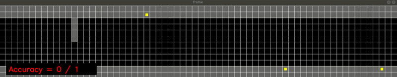
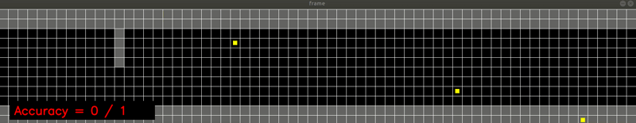
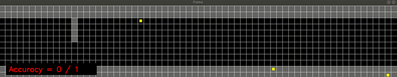
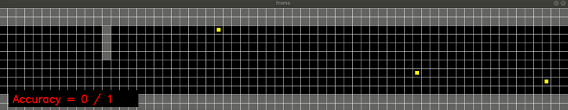
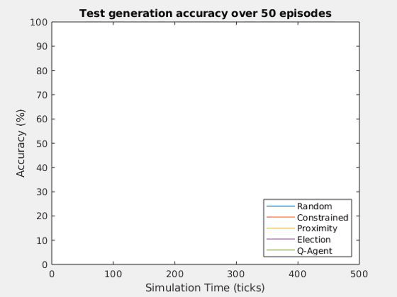

# CAV-Qagent
This is an extension of the previous work on agency-directed test generation, see https://github.com/TSL-UOB/CAV-MAS. In this work an additional test generation method, the Q-Agent, is included in the analysis of test generation for an autonomous driving scenario, where interesting tests are generated more readily than with random methods.

In the animations below, when pedestrians (yellow squares) intersect the vehilce stopping distance (grey bar) they produce a useful test that could be used for verification of vulnerable road user safety. This is a form of automatic test generation. The results below begin with very simple algorithms, random, and proceed to the Q-learning based agent. The counter shows how often a useful test is created compared to the number of episodes.

The Random test generation method uses random actions for shown here for 3 agents. 

Constrained random forces the agents to walk on the pavement with the action to cross the road with 10% probability.

Proximity agents will only cross the road when there is a vehicle within 15 units.

Election is based on the proximity agent, but here the agents decide when they should attempt to cross the road based on who is closest.

The Q-agent uses q-learning based on a functional representation of the environment.

The folowing graph shows the average accuracy for each method producing sucessfull tests over 50 episodes. Random agent actions perform the least accurately, generating the fewest useful tests. Constrained random does slightly better achieving around 50% accuracy. Proximity and Election achieve 80% and 70% respectively. The Q-agent achieves around 90% accuracy. Less simulation ticks are required when tests are generated quicker, these are seen in the shorter plot traces.

